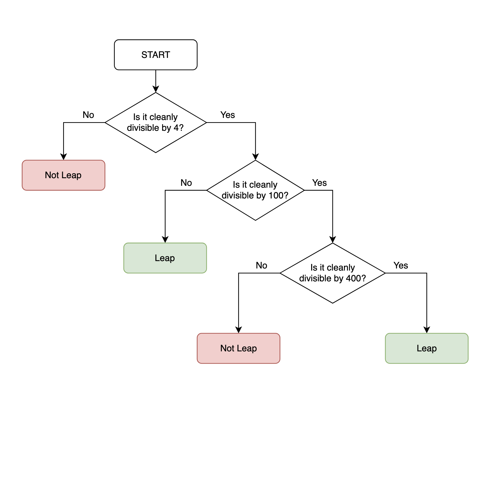

### Functions with Outputs

Functions with Outputs are functions which allow one to have an output once the function is completed
<br>

### Output Keyword: **return**

```python
def my_function():
    return 3 * 2
 
output = my_function() # output = 3 * 2 = 6
```

<br>


### PAUSE 1

Create a function called format_name() that takes two inputs: f_name and `l_name'.

```python
def format_name(f_name, l_name):

```

<br>

### PAUSE 2

Use the title() function to modify the f_name and l_name parameters into Title Case.

```python
def format_name(f_name, l_name):
    formated_f_name = f_name.title()
    formated_l_name = l_name.title()

    # print(f"{formated_f_name} {formated_l_name}")
    return f"{formated_f_name} {formated_l_name}"

# format_name("jisu", "park")
print(format_name("jisu", "park"))
```

<br>

### Print vs. Output (Display vs. Return)

Print is used to display a value to the console only for the programmer to see, whereas the return statement is used to give back a value from a function, which can be used later.

<br>

```python
def function_1(text):
    return text + text

def function_2(text):
    return text.title()

output = function_2(function_1("hello"))
print(output)
#Output: Hellohello
```

<br>

---

### Multiple return values

<br>

### Conditional Returns

When one has control flow, as in the code will behave differently (go down different execution paths) depending on certain conditional checks, one can end up with multiple endings (returns).

e.g.

```python
def canBuyAlcohol(age):
    if age >= 18:
        return True
    else:
        return False

```

<br>


### Empty Returns

One can also write return without anything afterwards, and this just tells the function to exit.

e.g.

```python
def canBuyAlcohol(age):
    # If the data type of the age input is not a int, then exit.
    if type(age) != int:
        return

    if age >= 18:
        return True
    else:
        return False
```

<br>

### Multi Return Values Example

```python
def format_name(f_name, l_name):
    if f_name == "" or l_name == "":
        return # To have meaningful output: return "You did not provide valid inputs."
    formated_f_name = f_name.title()
    formated_l_name = l_name.title()
    return f"{formated_f_name} {formated_l_name}"

print(format_name(input("What is your first name?"), input("What is your last name?")))
```

<br>

---

### Leap Year

Write a program that returns whether a given year is a leap year or not. The result must be True or False.

The average year is 365 days, and the leap year is 366 days, with one more day in February.

This is how to check if a particular year is a leap year.

- It corresponds to any year that falls by 4 without the rest.
- Excluding all years that fall by 100 without the rest.
- Except if the year is divided by 400.

<br>

e.g. Year 2000:

2000 ÷ 4 = 500 (Leap)

2000 ÷ 100 = 20 (Not Leap)

2000 ÷ 400 = 5 (Leap!)

So the year 2000 is a leap year.

<br>

But 2100 is not a leap year because:

2100 ÷ 4 = 525 (Leap)

2100 ÷ 100 = 21 (Not Leap)

2100 ÷ 400 = 5.25 (Not Leap)

<br>

Caution

Return value must be Boolean and exactly match the example output format, including spelling and punctuation.

<br>

Input Example 1

2400

Return Example 1

True

Input Example 2

1989

Return Example 2

False

<br>

**Flow Chart:**

<br>

<div align = center>



</div>

<br>

```python
def is_leap_year(year):
    if year % 4 == 0:
        if year % 100 == 0:
            if year % 400 == 0:
                return True
            else:
                return False
        else:
            return True
    else:
        return False
```

<br>

---

### Docstrings

Docstrings are a way for one to create bits of documentation as one is coding along in one’s functions, or in one’s other blocks of code

<br>

```python
def format_name(f_name, l_name):
    """Take a first and last name and format it
    to return the title case version of the name."""
    formated_f_name = f_name.title()
    formated_l_name = l_name.title()
    return f"{formated_f_name} {formated_l_name}"

formatted_name = format_name("AnGeLa", "YU")

length = len(formatted_name)
```

<br>

One can also use docstrings where one just comment as many lines as one like and this will be interpreted as a comment as long as it’s not assigned to anything

```python
"""
Comment line 1
Comment line 2
Comment line 3
"""
```

<br>

---

### Functions Quiz

**Q1: Answer the values that will be output from the console without running the code below.**

```python
def add(n1, n2):
  return n1 + n2
 
def subtract(n1, n2):
  return n1 - n2
 
def multiply(n1, n2):
  return n1 * n2
 
def divide(n1, n2):
  return n1 / n2
 
print(add(2, multiply(5, divide(8, 4))))
```

- 10
- **12.0**
- 0.21
- 14

A1: **12.0**

<br>

**Q2: What will happen if I run the following code?**

```python
def outer_function(a, b):
    def inner_function(c, d):
        return c + d
    return inner_function(a, b)
 
result = outer_function(5, 10)
print(result)
```

- SyntaxError
- **15**
- 10
- (5, 10)

A2: **15**

<br>

**Q3: What is the value output to the console after running the following code?**

```python
def my_function(a):
    if a < 40:
        return
        print("Terrible")
    if a < 80:
        return "Pass"
    else:
        return "Great"
print(my_function(25))
```

- NameError
- SyntaxError
- **None**
- “Pass”

A3: **None**

<br>
