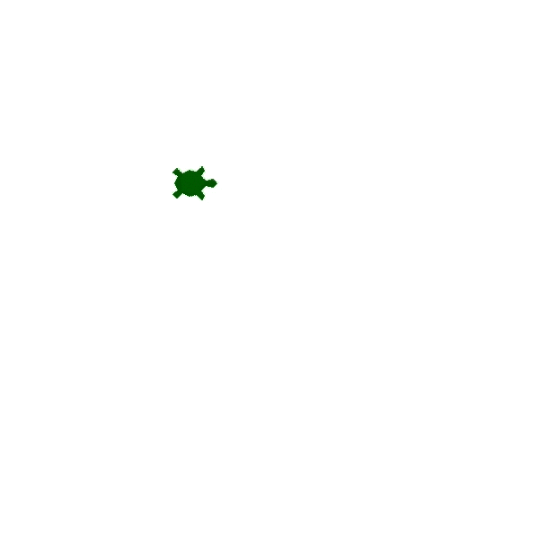

### Understanding Turtle Graphics and How to use the Documentation

<br>

### tkinter  (Tk)

The tkinter package (”Tk interface”) is the standard Python interface to the Tk GUI toolkit — Both Tk and tkinter are available on most Unix platforms, as well as Windows systems (Tk itself is not part of Python; it is maintained at ActiveState)

<br>

Tkinter is what the turtle module actually relies on under the hood to create the graphics 

<br>

**Tkinter colour list**

[Colors](https://trinket.io/docs/colors)

<br>

> tkinter (Tk) is one of the ways that one can use Python to create a graphical user interface (GUI)

<br>

### Graphical User Interface (GUI)

GUI shows images and allows one to click and drag and do all of those things by looking instead of just typing commands

<br>

```python
from turtle import Turtle, Screen

# Construct the turtle object
timmy_the_turtle = Turtle()

# Change the shape of the turtle
timmy_the_turtle.shape("turtle")

# Change the colour of the turtle
timmy_the_turtle.color("Darkgreen")

# Move turtle
# Move turtle forward by 100 spaces
timmy_the_turtle.forward(100)

# Turn turtle right by 90 degrees
timmy_the_turtle.right(90)

# Display screen
screen = Screen()
screen.exitonclick()
```

<br>

---
### Turtle Challenge 1 - Draw a Square

<br>

- Used Pycharm’s Refactor feature to rename timmy_the_turtle to tim

```python
from turtle import Turtle, Screen

# Construct the turtle object
tim = Turtle()

# Change the shape of the turtle
tim.shape("turtle")

# Change the colour of the turtle
tim.color("Darkgreen")

# Draw a square

for _ in range(4):
    # Move turtle forward by 100 spaces
    tim.forward(100)
    # Turn turtle right by 90 degrees
    tim.right(90)

# Display screen
screen = Screen()
screen.exitonclick()
```
<br>

<div align = center>
  
</div>

<br>

---
### Importing Modules, Installing Packages, and Working with Aliases

### Basic Import

```python
# (keyword) import module_name
import turtle

# To construct a new object
# Say a module name and the name of the class
tim = turtle.Turtle()
```

- Effective when one is using the module once or twice

<br>

### from … import

```python
# (keyword) from module_name (keyword) import thing_in_module
from turtle import Turtle

# To construct a new object
# Say a class name directly as the class was imported
tim = Turtle()
```

- Effective when one is using the module many times

<br>

**To import everything on the module**

```python
# (keyword) from module_name (keyword) import * (everything)
from turtle import *
forward()
```

- Can be confusing as to its origin since the code won’t tell where does it come from, which module enables the capability
- Try avoiding this method

<br>

### Aliasing Modules

```python
# (keyword) import module_name (keyword) as alias_name
import turtle as t
tim = t.Turtle()
```

<br>

### Installing Modules

Some modules are not packaged with the Python standard library — one has to install packages from online

<br>

```python
# After installation
import heroes
print(heroes.gen())
```

<br>

---
### Turtle Challenge 2 - Draw a Dashed Line

<br>

```python
from turtle import Turtle, Screen

# Construct the turtle object
tim = Turtle()

# Change the shape of the turtle
tim.shape("turtle")

# Change the colour of the turtle
tim.color("Darkgreen")

# Draw a dashed line

for _ in range(15):
    # Move turtle forward by 10 spaces
    tim.forward(10)
    # Stop turtle drawing
    tim.penup()
    # Move turtle forward by 10 spaces (to draw blank line)
    tim.forward(10)
    # Make turtle draw again
    tim.pendown()

# Display screen
screen = Screen()
screen.exitonclick()
```

<br>

<div align = center>
  
</div>

<br>

---
### Turtle Challenge 3 - Drawing Different Shapes

<br>

Draw a triangle, square, pentagon, hexagon, heptagon, octagon, nonagon and decagon

```python
from turtle import Turtle, Screen
import random

# Construct the turtle object
tim = Turtle()

# Change the shape of the turtle
tim.shape("turtle")

# Create a list of colour
colours = ["Salmon", "DarkOrange", "Gold", "OliveDrab", "CadetBlue", "LightSkyBlue", "SlateGray", "MediumSlateBlue"]

# Create a draw_shape function
def draw_shape(num_sides):
    # Calculate turn angle using the number of sides
    angle = 360 / num_sides
    # Draw different shapes
    for _ in range(num_sides):
        # Draw a shape with the side of 100 spaces
        tim.forward(100)
        # Make turtle turn right by angle
        tim.right(angle)

# Looping to draw from a triangle to decagon
for shape_side_n in range(3, 11):
    # Change the colour of the turtle
    tim.color(random.choice(colours))
    draw_shape(shape_side_n)

# Display screen
screen = Screen()
screen.exitonclick()
```

<br>

<div align = center>
  
</div>

<br>

---
### Turtle Challenge 4 - Generate a Random Walk

<br>

```python
from turtle import Turtle, Screen
import random

# Construct the turtle object
tim = Turtle()

# Create a list of colour
colours = ["Salmon", "DarkOrange", "Gold", "OliveDrab", "CadetBlue", "LightSkyBlue", "SlateGray", "MediumSlateBlue"]
# Create a list of direction
directions = [0, 90, 180, 270]
# Resize the pen's width
tim.pensize(15)
# Reset the turtle's speed
tim.speed("fastest")

# Loop to generate random walk
for _ in range(200):
    # Change turtle colour randomly
    tim.color(random.choice(colours))
    # Move turtle
    tim.forward(30)
    # Set the turtle heading to specific direction
    tim.setheading(random.choice(directions))

# Display screen
screen = Screen()
screen.exitonclick()
```

<br>

<div align = center>
  
</div>

<br>

---

### Python Tuples and How to Generate Random RGB Colours

Tuple in Python is very similar to a list. Each of the items that go into the tuple are ordered.

```python
my_tuple = (1, 3, 8)
my_tuple[2]
# Output: 8
```

<br>

### Tuple is immutable

Unlike a list, one cannot change the values of tuple

```python
my_tuple[2] = 12
```

```python
TypeError: 'tuple' object does not support item assignment
```

<br>

In case one needs to change the values, then one can simply put one’s tuple inside a list

```python
list(my_tuple)
```

```python
[1, 3, 8]
```

<br>

### Random walk in Random RGB colour

```python
import turtle as t
from turtle import Screen
import random

# Construct the turtle object
tim = t.Turtle()

# Change the color mode
t.colormode(255)

# Random colour generation
def random_color():
    r = random.randint(0, 255)
    g = random.randint(0, 255)
    b = random.randint(0, 255)
    random_color = (r, g, b)
    return random_color

# Create a list of direction
directions = [0, 90, 180, 270]
# Resize the pen's width
tim.pensize(15)
# Reset the turtle's speed
tim.speed("fastest")

# Loop to generate random walk
for _ in range(200):
    # Change turtle colour randomly
    tim.color(random_color())
    # Move turtle
    tim.forward(30)
    # Set the turtle heading to specific direction
    tim.setheading(random.choice(directions))
```

<br>

<div align = center>
  
</div>

<br>

---
### Turtle Challenge 5 - Draw a Spirograph

<br>

```python
import turtle as t
from turtle import Screen
import random

# Construct the turtle object
tim = t.Turtle()

# Change the color mode
t.colormode(255)

# Random colour generation
def random_color():
    r = random.randint(0, 255)
    g = random.randint(0, 255)
    b = random.randint(0, 255)
    color = (r, g, b)
    return color

# Reset the turtle's speed
tim.speed("fastest")

# Spirograph
def draw_spirograph(size_of_gaps):
    for _ in range(int(360 / size_of_gaps)):
        tim.color(random_color())
        tim.circle(100)
        tim.setheading(tim.heading() + 10)

draw_spirograph(5)

# Display screen
screen = t.Screen()
screen.exitonclick()
```

<br>

<br>

<div align = center>
  
</div>

<br>

---
### The Hirst Painting Project Part 1 - How to Extract RGB Values from Images

<br>

1. Download prerequisite: [colorgram.py](https://pypi.org/project/colorgram.py/) package
    1. Python library that lets one extract colours from images
2. Download any image that one likes
3. Include this image on the project directory
4. Generate a random canvas of spot painting

<br>

```python
# main.py
# # To extract colours
# import colorgram
# 
# rgb_colours = []
# # Extract RGB colours in tuples from the image
# colours = colorgram.extract('../image.jpg', 30)
# for colour in colours:
#     r = colour.rgb.r
#     g = colour.rgb.g
#     b = colour.rgb.b
#     new_colour = (r, g, b)
#     rgb_colours.append(new_colour)
# 
# print(rgb_colours)

colour_list = [(142, 152, 198), (231, 194, 217), (57, 115, 134), (185, 174, 219), (0, 59, 54), (188, 155, 171), (224, 173, 193), (1, 94, 109), (0, 69, 77), (252, 203, 184), (107, 129, 153), (24, 83, 80), (252, 170, 166), (203, 186, 223), (53, 93, 90), (117, 95, 107), (100, 134, 152), (150, 113, 132), (203, 151, 148), (52, 64, 79), (111, 85, 85), (189, 105, 99), (63, 50, 58), (80, 54, 61)]

```

<br>

---
### The Hirst Painting Project Part 2 - Drawing the Dots

<br>

Use the colour list to create the Hirst Painting

<br>

```python
import turtle as turtle_module
import random

# Change turtle's color mode to 255
turtle_module.colormode(255)

# Construct turtle object
tim = turtle_module.Turtle()
# Change turtle's speed
tim.speed("fastest")
# No need for drawing as dots are being painted
tim.penup ()
# Hide turtle to not see the arrow
tim.hideturtle()
colour_list = [(142, 152, 198), (231, 194, 217), (57, 115, 134), (185, 174, 219), (0, 59, 54), (188, 155, 171), (224, 173, 193), (1, 94, 109), (0, 69, 77), (252, 203, 184), (107, 129, 153), (24, 83, 80), (252, 170, 166), (203, 186, 223), (53, 93, 90), (117, 95, 107), (100, 134, 152), (150, 113, 132), (203, 151, 148), (52, 64, 79), (111, 85, 85), (189, 105, 99), (63, 50, 58), (80, 54, 61)]

# Change the turtle's heading for the starting point
tim.setheading(225) # midpoint of 180 and 270
tim.forward(300) # 50 paces times 5 + 50 to have enough space for dots
tim.setheading(0) # Change heading to make turtle move to the right direction
number_of_dots = 100 # 10 * 10

# Loop turtle's movement & colour randomisation
for dot_count in range (1, number_of_dots + 1):
    tim.dot(20, random.choice(colour_list)) # Randomise colour choices
    tim.forward(50) # Move turtle

    if dot_count % 10 == 0:
        # Create a new line
        tim.setheading(90) # Rotate turtle to face up
        tim.forward(50) # Move turtle by 50 paces
        tim.setheading(180) # Rotate turtle to face left
        tim.forward(500) # 5 * 100
        tim.setheading(0) # Rotate turtle to face right

# Create screen object
screen = turtle_module.Screen()
# Change the screen's behaviour
screen.exitonclick()

```

<br>

