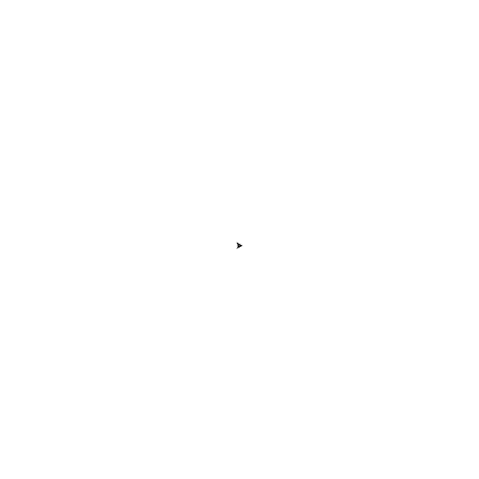
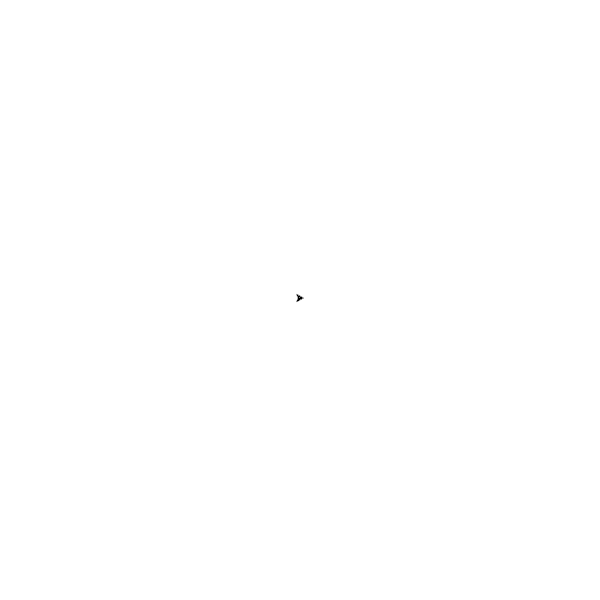
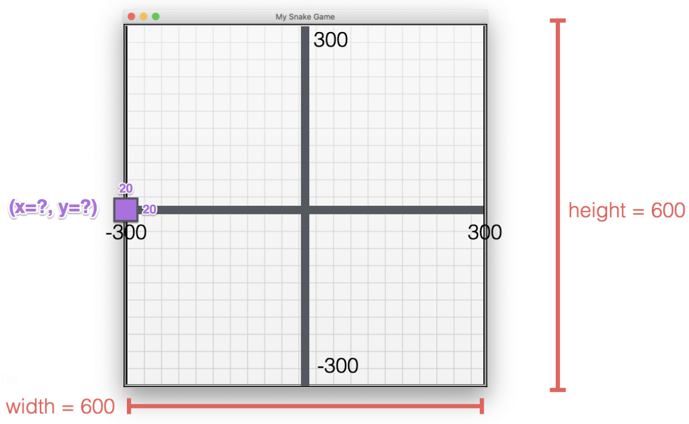
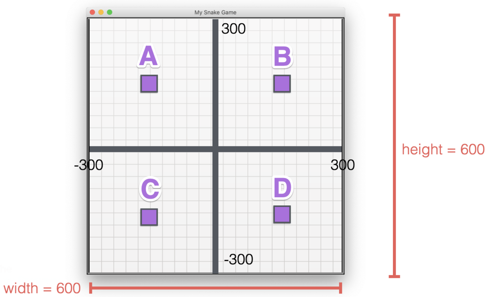

### Python Higher Order Functions & Event Listeners

<br>

In order to be able to create a lot of games, one needs an event listeners

<br>

### Event Listeners

The code that listens to things the user does

<br>

```python
from turtle import Turtle, Screen

# Construct a turtle object
tim = Turtle()

# Construct a screen object
screen = Screen()

def move_forwards():
    tim.forward(10)

# To start listening for events
screen.listen()

# To bind a keystroke to an event
screen.onkey(key="space", fun=move_forwards) # Parentheses are only used to trigger function
screen.exitonclick()
```

<br>

<div align = center>
    
</div>

<br>

---
### Functions as Inputs

When passing a function as an input, only pass the name without the parentheses at the end

```python
def function_a(something):
    # Do this with something
    # Then do this
    # Finally do this
    
def function_b():
    # Do this

def function_a(function_b)
```

<br>

e.g.

```python
def add(n1, n2):
    return n1 + n2

def subtract(n1, n2):
    return n1 - n2
    
def multiply(n1, n2):
    return n1 * n2

def divide(n1, n2):
    return n1 / n2
    
def calculator(n1, n2, func):
    return func(n1, n2)
    
result = calculator(2, 3, add)
print(result)
# Output: 5

result2 = calculator(2, 3, multiply)
print(result2)
# Output: 6
```

<br>

### Higher Order Functions

A function that can work with other functions

- The function, calculator, is a higher order function because it is actually taking another as an input, and then working with it inside the body of the function

```python
def add(n1, n2):
    return n1 + n2

def subtract(n1, n2):
    return n1 - n2
    
def multiply(n1, n2):
    return n1 * n2

def divide(n1, n2):
    return n1 / n2
    
def calculator(n1, n2, func):
    return func(n1, n2)
    
result = calculator(2, 3, add)
print(result)
# Output: 5

result2 = calculator(2, 3, multiply)
print(result2)
# Output: 6
```

<br>

---
### Challenge: Make an Etch-A-Sketch App

Build a Etch-A-Sketch app

1. Create a turtle that will allow one to press:
    1. W key to go forwards
    2. S key to go backwards
    3. A key to go counter-clockwise or leftwards
    4. D key to go clockwise or rightwards
    5. C key to clear drawing and put the turtle back in the center
    
<br>

```python
from turtle import Turtle, Screen

# Construct a turtle object
tim = Turtle()

# Construct a screen object
screen = Screen()

# To move forwards
def move_forwards():
    tim.forward(10)

# To move backwards
def move_backwards():
    tim.backward(10)

# To move forwards
def turn_left():
    new_heading = tim.heading() + 10
    tim.setheading(new_heading)

# To move forwards
def turn_right():
    new_heading = tim.heading() - 10
    tim.setheading(new_heading)

# To clear the screen
def clear():
    tim.clear() # Clear the turtle's drawing
    tim.penup() # Let the turtle not draw while moving to the center
    tim.home() # Locate turtle to the center of the screen
    tim.pendown() # Make turtle ready to draw again

# To start listening for events
screen.listen()

# To bind a keystroke to an event
screen.onkey(key="w", fun=move_forwards)
screen.onkey(key="s", fun=move_backwards)
screen.onkey(key="a", fun=turn_left)
screen.onkey(key="d", fun=turn_right)
screen.onkey(key="c", fun=clear)
screen.exitonclick()
```

<br>

<div align = center>
    
</div>

<br>

---
### Object State and Instances

One can use a class or a blueprint to define what an object should appear like and how it should behave, what it has and what it can do — taking this class and construct an actual object from it

<br>

|  | <center> Object </center> |  | <center> Class </center> |
| :---: | :---: | :---: | :---: |
| Instance | timmy | = | Turtle() |
| Instance | tommy | = | Turtle() |


- Class is used to construct the objects called timmy
- Also got a separate object called tommy
- Timmy and tommy are both turtle objects, but they are different instances — They can have different state
    - They can act independently
    - They can have different apperances
    - They can have different colours
    - They can have different attributes
    - They can have different speed of movement
    - They can be performing different methods at any one time
    - etc

<br>

---
### Understanding the Turtle Coordinate System

Build a Turtle Race

1. Asks a user to  place a bet on which turtle will win the race
2. Create six turtles, each with a distinct colour
3. Position the turtles on the left side of the screen, evenly spaced vertically

<br>

```python
from turtle import Turtle, Screen

# Construct a screen object
screen = Screen()
# Resize the screen
screen.setup(width=500, height=400)

# Take a user input
user_bet = screen.textinput(title="Make your bet", prompt="Which turtle will win the race? Enter a colour: ").lower()

# Turtle colour list
colours = ["red", "orange", "yellow", "green", "blue", "purple"]

# y_position of turtles
y_positions = [-70, -40, -10, 20, 50, 80]

# Looping the turtle creation to create six turtles
for turtle_index in range(0, 6):
    # Construct a turtle object, shaped as a turtle
    tim = Turtle(shape="turtle")
    # Change the colours of turtles
    tim.color(colours[turtle_index])
    # Not drawing so no need for pen to be down
    tim.penup()
    # Relocate turtle using coordinate
    tim.goto(x = -230, y = y_positions[turtle_index])

screen.exitonclick()

```

<br>

---

### Turtle Coordinate System Quiz

**Q1: Where is the following turtle headed?**

🐢

- 0 (E)
- 90 (N)
- **180** (W)
- 270 (S)

A1: 180

<br>

**Q2: What are the coordinates of the purple turtle on the following 600px x 600px screen?**

**Hint: By default, all turtles are 20px in height and 20px in width.**

<div align = center>
  
</div>

- **(x=-300, y=0)**
- (x=-310, y=0)
- (x=-320, y=0)
- (x=-280, y=0)
- (x=-290, y=0)

A2: **(x=-300, y=0)**

<br>

**Q3: All turtles start at the (0, 0) position after the following code is executed. Where is the turtle?**
```python
turtle.goto(-150,150)
```
<div align = center>
  
</div>

- **A**
- B
- C
- D

A3: **A**


