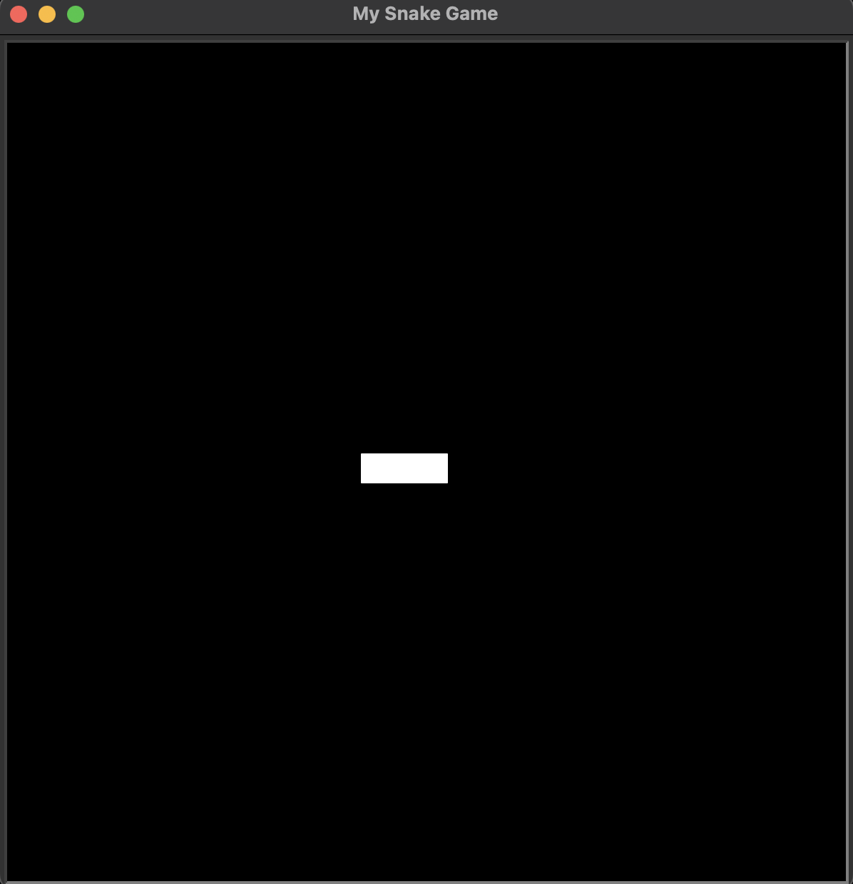
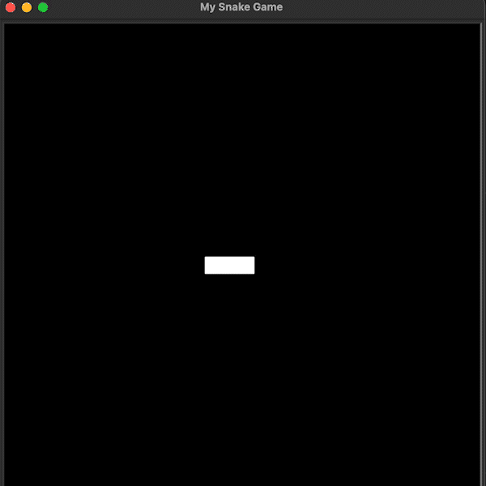
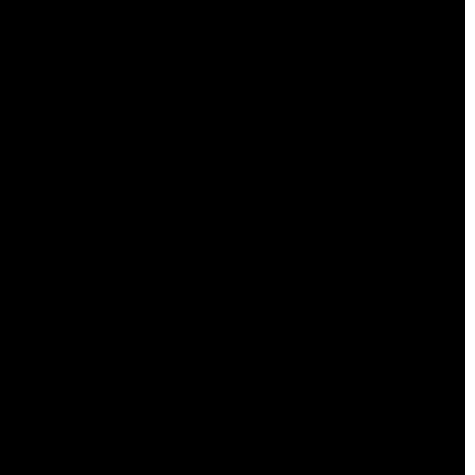

### Screen Setup and Creating a Snake Body

```python
from turtle import Screen, Turtle

# Construct a screen object
screen = Screen()

# Set up a screen
screen.setup(width=600, height=600)
# Change the background colour
screen.bgcolor("black")
# Name a programme
screen.title("My Snake Game")

# Position list for segments in list
starting_positions = [(0,0), (-20,0), (-40,0)]

for position in starting_positions:
    # Initialise segment object and set its shape to square
    new_segment = Turtle(shape="square")
    # Set its colour as white
    new_segment.color("white")
    # Position segment to the coordinate that is currently on loop
    new_segment.goto(position)

# Display the screen until it is clicked
screen.exitonclick()
```

<br>

<div align = center>
    
</div>

<br>

---

### Animating the Snake Segments on Screen

```python
from turtle import Screen, Turtle
import time

# Construct a screen object
screen = Screen()

# Set up a screen
screen.setup(width=600, height=600)
# Change the background colour
screen.bgcolor("black")
# Name a programme
screen.title("My Snake Game")
#Turn off the tracer
screen.tracer(0)
# Position list for segments in list
starting_positions = [(0,0), (-20,0), (-40,0)]

# Create a list for segments
segments = []

for position in starting_positions:
    # Initialise segment object and set its shape to square
    new_segment = Turtle(shape="square")
    # Set its colour as white
    new_segment.color("white")
    # Do not need to draw
    new_segment.penup()
    # Position segment to the coordinate that is currently on loop
    new_segment.goto(position)
    # Add created segments to the segments list
    segments.append(new_segment)

# Set the game state to on
game_is_on = True

# Get a snake to automatically move forwards
while game_is_on:
    # Refresh the graphic
    screen.update()
    # Delay the animation by 0.1 second
    time.sleep(0.1)

    # Loop in a reverse order to link segments' movements and form a snake
    for seg_num in range(len(segments) - 1, 0, -1):
        new_x = segments[seg_num - 1].xcor()
        new_y = segments[seg_num - 1].ycor()
        segments[seg_num].goto(new_x, new_y)
    # Move linked segments (snake)
    segments[0].forward(20)

# Display the screen until it is clicked
screen.exitonclick()
```

<br>

<div align = center>
    
</div>

<br>
---

### Create a Snake Class & Move to OOP

```python
# snake.py
from turtle import Turtle

# Position list for segments in list
STARTING_POSITIONS = [(0, 0), (-20, 0), (-40, 0)]
# Set a distance that a snake moves in constant
MOVE_DISTANCE = 20

class Snake:

# Define what happens when the class gets initialised
    def __init__(self):
        # Create a list for segments
        self.segments = [] # Need to use self. when working with a class
        # Call a create_snake() method here to create a snake
        self.create_snake()

    def create_snake(self):
        for position in STARTING_POSITIONS:
            # Initialise segment object and set its shape to square
            new_segment = Turtle(shape="square")
            # Set its colour as white
            new_segment.color("white")
            # Do not need to draw
            new_segment.penup()
            # Position segment to the coordinate that is currently on loop
            new_segment.goto(position)
            # Add created segments to the segments list
            self.segments.append(new_segment)

    def move(self):
        # Loop in a reverse order to link segments' movements and form a snake
        for seg_num in range(len(self.segments) - 1, 0, -1):
            new_x = self.segments[seg_num - 1].xcor()
            new_y = self.segments[seg_num - 1].ycor()
            self.segments[seg_num].goto(new_x, new_y)
        # Move linked segments (snake)
        self.segments[0].forward(MOVE_DISTANCE)

```

```python
# main.py
from turtle import Screen, Turtle
from snake import Snake
import time

# Construct a screen object
screen = Screen()

# Set up a screen
screen.setup(width=600, height=600)
# Change the background colour
screen.bgcolor("black")
# Name a programme
screen.title("My Snake Game")
#Turn off the tracer
screen.tracer(0)

# Construct a snake object from Snake class
snake = Snake()

# Set the game state to on
game_is_on = True

# Update screen every 0.1 second
while game_is_on:
    # Refresh the graphic
    screen.update()
    # Delay the animation by 0.1 second
    time.sleep(0.1)
    # Every time the screen refreshes, move snake forward by a step
    snake.move()

# Display the screen until it is clicked
screen.exitonclick()
```

<br>

<div align = center>
    
</div>

<br>

---

### How to Control the Snake with a Keypress

```python
# snake.py
from turtle import Turtle

# Position list for segments in list
STARTING_POSITIONS = [(0, 0), (-20, 0), (-40, 0)]
# Set a distance that a snake moves in constant
MOVE_DISTANCE = 20
# Constants for directions
UP = 90
DOWN = 270
LEFT = 180
RIGHT = 0

class Snake:

# Define what happens when the class gets initialised
    def __init__(self):
        # Create a list for segments
        self.segments = [] # Need to use self. when working with a class
        # Call a create_snake() method here to create a snake
        self.create_snake()
        # Set the first segment equal to the head attribute (= Set the first segment as the snake's head)
        self.head = self.segments[0]

# Create a snake
    def create_snake(self):
        for position in STARTING_POSITIONS:
            # Initialise segment object and set its shape to square
            new_segment = Turtle(shape="square")
            # Set its colour as white
            new_segment.color("white")
            # Do not need to draw
            new_segment.penup()
            # Position segment to the coordinate that is currently on loop
            new_segment.goto(position)
            # Add created segments to the segments list
            self.segments.append(new_segment)

# Move a snake
    def move(self):
        # Loop in a reverse order to link segments' movements and form a snake
        for seg_num in range(len(self.segments) - 1, 0, -1):
            new_x = self.segments[seg_num - 1].xcor()
            new_y = self.segments[seg_num - 1].ycor()
            self.segments[seg_num].goto(new_x, new_y)
        # Move linked segments (snake)
        self.head.forward(MOVE_DISTANCE)

# Turn snake upwards
    def up(self):
        if self.head.heading() != DOWN: # heading() is a turtle's method to check its direction (in number e.g. 90 - N)
            self.head.setheading(UP)

# Turn snake downwards
    def down(self):
        if self.head.heading() != UP:
            self.head.setheading(DOWN)

# Turn snake leftwards
    def left(self):
        if self.head.heading() != RIGHT:
            self.head.setheading(LEFT)

# Turn snake rightwards
    def right(self):
        if self.head.heading() != LEFT:
            self.head.setheading(RIGHT)
```

```python
# main.py
from turtle import Screen, Turtle
from snake import Snake
import time

# Construct a screen object
screen = Screen()

# Set up a screen
screen.setup(width=600, height=600)
# Change the background colour
screen.bgcolor("black")
# Name a programme
screen.title("My Snake Game")
#Turn off the tracer
screen.tracer(0)

# Construct a snake object from Snake class
snake = Snake()

# Set the game state to on
game_is_on = True

# Update screen every 0.1 second
while game_is_on:
    # Refresh the graphic
    screen.update()
    # Delay the animation by 0.1 second
    time.sleep(0.1)
    # Every time the screen refreshes, move snake forward by a step
    snake.move()

# Display the screen until it is clicked
screen.exitonclick()
```

<br>

<div align = center>
    
</div>

<br>

