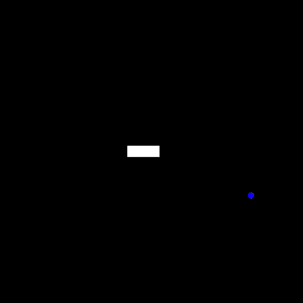
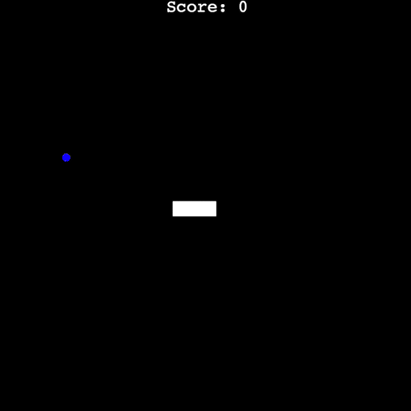
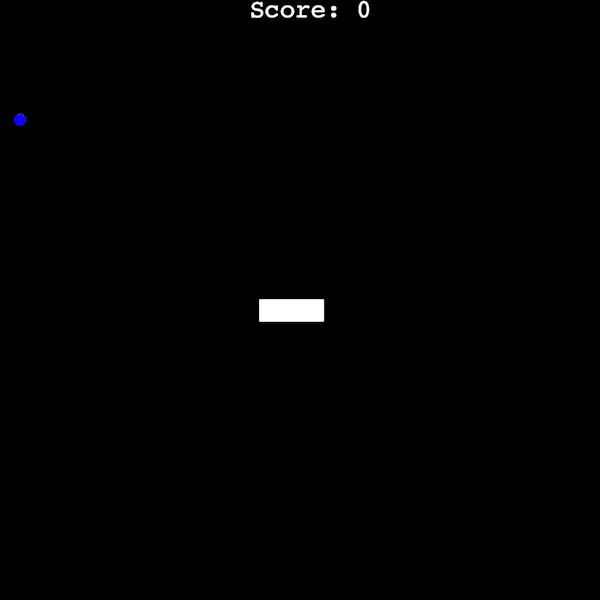
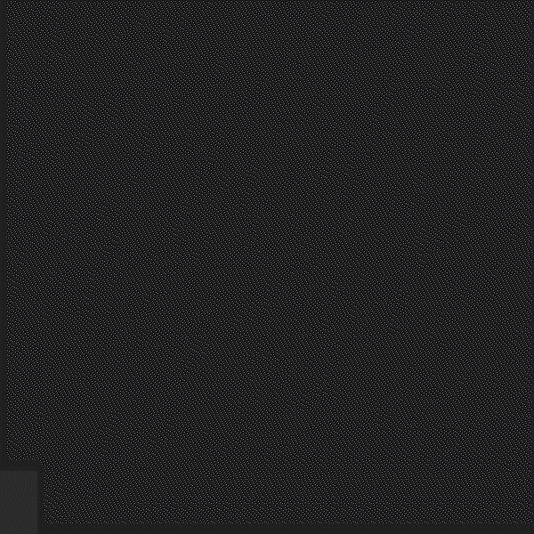

### Class Inheritance

Classes can inherit from other classes, inheriting attributes, inheriting methods — a way to make it simpler to modify classes and give them more capabilities

<br>

```python
class Animal:
    def __init__(self):
        self.num_eyes = 2

    def breathe(self):
        print("Inhale, exhale.")
        
class Fish(Animal):
    def __init__(self):
        super().__init__()
        
    def breathe(self):
        super().breathe() # Inherited method from the superclass
        print("doing this under water") # Added a functionality to the existing inherited method
    
    def swim(self):
        print("moving in water.")        

# Consturct an object from Fish class        
nemo = Fish()
# Call a method from a Fish class
nemo.swim()

# Inherited attribute
print(nemo.num_eyes)
# Inherited method
nemo.breathe()
```

<br>

---

### Inheritance Quiz

**Q1: Check the following code.**

```python
class Dog:
    def __init__(self):
        self.temperament = "loyal"
 
    def bark(self):
        print("Woof, woof!")
```

**How would one create a class (subclass) called Labrador that is inherited from a Dog class (superclass)?**

<br>

```python
class Labrador():
    def __init__():
        super().__init__()
        self.temperament = "outgoing"
```

```python
class Labrador(Dog):
    def __init__(self):
        self.temperament = "outgoing"
```

```python
class Dog(Labrador):
    def __init__(self):
        super().__init__()
        self.temperament = "sarcastic"
```

```python
Labrador = Dog()
```

A1: **2nd code**

<br>

**Q2:** **Check the following code.**

```python
class Dog:
    def __init__(self):
        self.temperament = "loyal"
 
class Labrador(Dog):
    def __init__(self):
        super().__init__()
        self.temperament = "gentle"
```

<br>

**What is the value that this code outputs?**

```python
doggo = Dog()
print(f"A dog is {doggo.temperament}")
 
sparky = Labrador()
print(f"Sparky is {sparky.temperament}")
```

- No value is output, this code causes an error and will not run
- A dog is loyal
    
    Sparky is loyal
    
- **A dog is loyal**
    
    **Sparky is gentle**
    

A2: **3rd option**

<br>

**Q3: Check the following code.**

```python
class Dog:
    def __init__(self):
        self.temperament = "loyal"
 
    def bark(self):
        print("Woof, woof!")
 
class Labrador(Dog):
    def __init__(self):
        super().__init__()
        self.is_a_good_boy = True
 
    def bark(self):
        super().bark()
        print("Greetings, good sir. How do you do?")
```

<br>

**What is the value that this code outputs?**

```python
sparky = Labrador()
sparky.bark()
```

- Greetings, good sir. How do you do?
- Woof, woof!
- **Woof, woof!**
    
    **Greetings, good sir. How do you do?**
    
- Code is not executed due to an error

A3: **3rd option**

<br>

---

### Detect Collisions with Food

<br>

```python
# food.py
from turtle import Turtle
import random

# Create a Food class that inherits Turtle class
class Food(Turtle):
# Initialise Food class
    def __init__(self):
        # Call a superclass (Turtle class) to inherit
        super().__init__()
        # Change the Turtle shape to circle
        self.shape("circle")
        # Do not need to draw
        self.penup()
        # Resize the shape size (stretch the turtle along with the length, width)
        self.shapesize(0.5, 0.5)
        # Change the turtle color
        self.color("blue")
        # Change the turtle speed
        self.speed("fastest")
        # Relocate the food
        self.refresh()

# Relocate the food after collision
    def refresh(self):
        # Create a randomised coordinate x and y
        random_x = random.randint(-280, 280)
        random_y = random.randint(-280, 280)
        # Move food to randomised coordinate
        self.goto(random_x, random_y)

```

```python
# snake.py
from turtle import Turtle

# Position list for segments in list
STARTING_POSITIONS = [(0, 0), (-20, 0), (-40, 0)]
# Set a distance that a snake moves in constant
MOVE_DISTANCE = 20
# Constants for directions
UP = 90
DOWN = 270
LEFT = 180
RIGHT = 0

class Snake:

# Define what happens when the class gets initialised
    def __init__(self):
        # Create a list for segments
        self.segments = [] # Need to use self. when working with a class
        # Call a create_snake() method here to create a snake
        self.create_snake()
        # Set the first segment equal to the head attribute (= Set the first segment as the snake's head)
        self.head = self.segments[0]

# Create a snake
    def create_snake(self):
        for position in STARTING_POSITIONS:
            # Initialise segment object and set its shape to square
            new_segment = Turtle(shape="square")
            # Set its colour as white
            new_segment.color("white")
            # Do not need to draw
            new_segment.penup()
            # Position segment to the coordinate that is currently on loop
            new_segment.goto(position)
            # Add created segments to the segments list
            self.segments.append(new_segment)

# Move a snake
    def move(self):
        # Loop in a reverse order to link segments' movements and form a snake
        for seg_num in range(len(self.segments) - 1, 0, -1):
            new_x = self.segments[seg_num - 1].xcor()
            new_y = self.segments[seg_num - 1].ycor()
            self.segments[seg_num].goto(new_x, new_y)
        # Move linked segments (snake)
        self.head.forward(MOVE_DISTANCE)

# Turn snake upwards
    def up(self):
        if self.head.heading() != DOWN: # heading() is a turtle's method to check its direction (in number e.g. 90 - N)
            self.head.setheading(UP)

# Turn snake downwards
    def down(self):
        if self.head.heading() != UP:
            self.head.setheading(DOWN)

# Turn snake leftwards
    def left(self):
        if self.head.heading() != RIGHT:
            self.head.setheading(LEFT)

# Turn snake rightwards
    def right(self):
        if self.head.heading() != LEFT:
            self.head.setheading(RIGHT)
```

```python
# main.py
from turtle import Screen
from snake import Snake
from food import Food
import time

# Construct a screen object
screen = Screen()

# Set up a screen
screen.setup(width=600, height=600)
# Change the background colour
screen.bgcolor("black")
# Name a programme
screen.title("My Snake Game")
#Turn off the tracer
screen.tracer(0)

# Construct a snake object from Snake class
snake = Snake()

# Initialise Food
food = Food()

# Start listening for keystrokes
screen.listen()

# Listen for arrow keys
screen.onkey(snake.up,"Up")
screen.onkey(snake.down,"Down")
screen.onkey(snake.left,"Left")
screen.onkey(snake.right,"Right")

# Set the game state to on
game_is_on = True

# Update screen every 0.1 second
while game_is_on:
    # Refresh the graphic
    screen.update()
    # Delay the animation by 0.1 second
    time.sleep(0.1)
    # Every time the screen refreshes, move snake forward by a step
    snake.move()

    # Detect collision with food
    if snake.head.distance(food) < 15:
        food.refresh()

# Display the screen until it is clicked
screen.exitonclick()
```

<br>

<div align = center>
  
</div>

<br>

---
### Create a Scoreboard and Keep Score

<br>

```python
# scoreboard.py
from turtle import Turtle

# Constants for scoreboard alignment and font
ALIGNMENT = "center"
FONT = ("Courier", 24, "normal")

# Create a Scoreboard class that inherits Turtle class
class Scoreboard(Turtle):
# Initialise Scoreboard class
    def __init__(self):
        # Call a superclass (Turtle class) to inherit
        super().__init__()
        # Initialise score
        self.score = 0
        # Change the font color
        self.color("white")
        # No need for drawing
        self.penup()
        # Move the scoreboard to the top of the screen
        self.goto(0, 270)
        # Write a score on the screen
        self.update_scoreboard()
        # Don't need to see the arrow as just need a score written on the screen
        self.hideturtle()

    def update_scoreboard(self):
        # Write a score on the screen
        self.write(f"Score: {self.score}", align=ALIGNMENT, font=FONT)

    def increase_score(self):
        # Increase a score by 1 point
        self.score += 1
        # Clear the previous text that was written
        self.clear()
        # Write a score on the screen
        self.update_scoreboard()

```

```python
# snake.py
from turtle import Turtle

# Position list for segments in list
STARTING_POSITIONS = [(0, 0), (-20, 0), (-40, 0)]
# Set a distance that a snake moves in constant
MOVE_DISTANCE = 20
# Constants for directions
UP = 90
DOWN = 270
LEFT = 180
RIGHT = 0

class Snake:

# Define what happens when the class gets initialised
    def __init__(self):
        # Create a list for segments
        self.segments = [] # Need to use self. when working with a class
        # Call a create_snake() method here to create a snake
        self.create_snake()
        # Set the first segment equal to the head attribute (= Set the first segment as the snake's head)
        self.head = self.segments[0]

# Create a snake
    def create_snake(self):
        for position in STARTING_POSITIONS:
            # Initialise segment object and set its shape to square
            new_segment = Turtle(shape="square")
            # Set its colour as white
            new_segment.color("white")
            # Do not need to draw
            new_segment.penup()
            # Position segment to the coordinate that is currently on loop
            new_segment.goto(position)
            # Add created segments to the segments list
            self.segments.append(new_segment)

# Move a snake
    def move(self):
        # Loop in a reverse order to link segments' movements and form a snake
        for seg_num in range(len(self.segments) - 1, 0, -1):
            new_x = self.segments[seg_num - 1].xcor()
            new_y = self.segments[seg_num - 1].ycor()
            self.segments[seg_num].goto(new_x, new_y)
        # Move linked segments (snake)
        self.head.forward(MOVE_DISTANCE)

# Turn snake upwards
    def up(self):
        if self.head.heading() != DOWN: # heading() is a turtle's method to check its direction (in number e.g. 90 - N)
            self.head.setheading(UP)

# Turn snake downwards
    def down(self):
        if self.head.heading() != UP:
            self.head.setheading(DOWN)

# Turn snake leftwards
    def left(self):
        if self.head.heading() != RIGHT:
            self.head.setheading(LEFT)

# Turn snake rightwards
    def right(self):
        if self.head.heading() != LEFT:
            self.head.setheading(RIGHT)
```

```python
# food.py
from turtle import Turtle
import random

# Create a Food class that inherits Turtle class
class Food(Turtle):
# Initialise Food class
    def __init__(self):
        # Call a superclass (Turtle class) to inherit
        super().__init__()
        # Change the Turtle shape to circle
        self.shape("circle")
        # Do not need to draw
        self.penup()
        # Resize the shape size (stretch the turtle along with the length, width)
        self.shapesize(0.5, 0.5)
        # Change the turtle color
        self.color("blue")
        # Change the turtle speed
        self.speed("fastest")
        # Relocate the food
        self.refresh()

# Relocate the food after collision
    def refresh(self):
        # Create a randomised coordinate x and y
        random_x = random.randint(-280, 280)
        random_y = random.randint(-280, 280)
        # Move food to randomised coordinate
        self.goto(random_x, random_y)

```

```python
# main.py
from turtle import Screen
from snake import Snake
from food import Food
from scoreboard import Scoreboard
import time

# Construct a screen object
screen = Screen()

# Set up a screen
screen.setup(width=600, height=600)
# Change the background colour
screen.bgcolor("black")
# Name a programme
screen.title("My Snake Game")
#Turn off the tracer
screen.tracer(0)

# Construct a snake object from Snake class
snake = Snake()

# Construct a food object from Food class (Initialise food)
food = Food()

# Construct a scoreboard object from Scoreboard class
scoreboard = Scoreboard()

# Start listening for keystrokes
screen.listen()

# Listen for arrow keys
screen.onkey(snake.up,"Up")
screen.onkey(snake.down,"Down")
screen.onkey(snake.left,"Left")
screen.onkey(snake.right,"Right")

# Set the game state to on
game_is_on = True

# Update screen every 0.1 second
while game_is_on:
    # Refresh the graphic
    screen.update()
    # Delay the animation by 0.1 second
    time.sleep(0.1)
    # Every time the screen refreshes, move snake forward by a step
    snake.move()

    # Detect collision with food
    if snake.head.distance(food) < 15:
        # Relocate the food
        food.refresh()
        # Increase the score on the score board
        scoreboard.increase_score()

# Display the screen until it is clicked
screen.exitonclick()
```

<br>

<div align = center>
  
</div>

<br>

---
### Detect Collisions with the Wall

<br>

```python
# scoreboard.py
from turtle import Turtle

# Constants for scoreboard alignment and font
ALIGNMENT = "center"
FONT = ("Courier", 24, "normal")

# Create a Scoreboard class that inherits Turtle class
class Scoreboard(Turtle):
# Initialise Scoreboard class
    def __init__(self):
        # Call a superclass (Turtle class) to inherit
        super().__init__()
        # Initialise score
        self.score = 0
        # Change the font color
        self.color("white")
        # No need for drawing
        self.penup()
        # Move the scoreboard to the top of the screen
        self.goto(0, 270)
        # Write a score on the screen
        self.update_scoreboard()
        # Don't need to see the arrow as just need a score written on the screen
        self.hideturtle()

    def update_scoreboard(self):
        # Write a score on the screen
        self.write(f"Score: {self.score}", align=ALIGNMENT, font=FONT)

    def game_over(self):
        self.goto(0, 0)
        self.write("GAME OVER", align=ALIGNMENT, font=FONT)

		def increase_score(self):
        # Increase a score by 1 point
        self.score += 1
        # Clear the previous text that was written
        self.clear()
        # Write a score on the screen
        self.update_scoreboard()

```

```python
# food.py
from turtle import Turtle
import random

# Create a Food class that inherits Turtle class
class Food(Turtle):
# Initialise Food class
    def __init__(self):
        # Call a superclass (Turtle class) to inherit
        super().__init__()
        # Change the Turtle shape to circle
        self.shape("circle")
        # Do not need to draw
        self.penup()
        # Resize the shape size (stretch the turtle along with the length, width)
        self.shapesize(0.5, 0.5)
        # Change the turtle color
        self.color("blue")
        # Change the turtle speed
        self.speed("fastest")
        # Relocate the food
        self.refresh()

# Relocate the food after collision
    def refresh(self):
        # Create a randomised coordinate x and y
        random_x = random.randint(-280, 280)
        random_y = random.randint(-280, 280)
        # Move food to randomised coordinate
        self.goto(random_x, random_y)

```

```python
# snake.py
from turtle import Turtle

# Position list for segments in list
STARTING_POSITIONS = [(0, 0), (-20, 0), (-40, 0)]
# Set a distance that a snake moves in constant
MOVE_DISTANCE = 20
# Constants for directions
UP = 90
DOWN = 270
LEFT = 180
RIGHT = 0

class Snake:

# Define what happens when the class gets initialised
    def __init__(self):
        # Create a list for segments
        self.segments = [] # Need to use self. when working with a class
        # Call a create_snake() method here to create a snake
        self.create_snake()
        # Set the first segment equal to the head attribute (= Set the first segment as the snake's head)
        self.head = self.segments[0]

# Create a snake
    def create_snake(self):
        for position in STARTING_POSITIONS:
            # Initialise segment object and set its shape to square
            new_segment = Turtle(shape="square")
            # Set its colour as white
            new_segment.color("white")
            # Do not need to draw
            new_segment.penup()
            # Position segment to the coordinate that is currently on loop
            new_segment.goto(position)
            # Add created segments to the segments list
            self.segments.append(new_segment)

# Move a snake
    def move(self):
        # Loop in a reverse order to link segments' movements and form a snake
        for seg_num in range(len(self.segments) - 1, 0, -1):
            new_x = self.segments[seg_num - 1].xcor()
            new_y = self.segments[seg_num - 1].ycor()
            self.segments[seg_num].goto(new_x, new_y)
        # Move linked segments (snake)
        self.head.forward(MOVE_DISTANCE)

# Turn snake upwards
    def up(self):
        if self.head.heading() != DOWN: # heading() is a turtle's method to check its direction (in number e.g. 90 - N)
            self.head.setheading(UP)

# Turn snake downwards
    def down(self):
        if self.head.heading() != UP:
            self.head.setheading(DOWN)

# Turn snake leftwards
    def left(self):
        if self.head.heading() != RIGHT:
            self.head.setheading(LEFT)

# Turn snake rightwards
    def right(self):
        if self.head.heading() != LEFT:
            self.head.setheading(RIGHT)
```

```python
# main.py
from turtle import Screen
from snake import Snake
from food import Food
from scoreboard import Scoreboard
import time

# Construct a screen object
screen = Screen()

# Set up a screen
screen.setup(width=600, height=600)
# Change the background colour
screen.bgcolor("black")
# Name a programme
screen.title("My Snake Game")
#Turn off the tracer
screen.tracer(0)

# Construct a snake object from Snake class
snake = Snake()

# Construct a food object from Food class (Initialise food)
food = Food()

# Construct a scoreboard object from Scoreboard class
scoreboard = Scoreboard()

# Start listening for keystrokes
screen.listen()

# Listen for arrow keys
screen.onkey(snake.up,"Up")
screen.onkey(snake.down,"Down")
screen.onkey(snake.left,"Left")
screen.onkey(snake.right,"Right")

# Set the game state to on
game_is_on = True

# Update screen every 0.1 second
while game_is_on:
    # Refresh the graphic
    screen.update()
    # Delay the animation by 0.1 second
    time.sleep(0.1)
    # Every time the screen refreshes, move snake forward by a step
    snake.move()

    # Detect collision with food
    if snake.head.distance(food) < 15:
        # Relocate the food
        food.refresh()
        # Increase the score on the score board
        scoreboard.increase_score()

    # Detect collision with wall
    if snake.head.xcor() > 280 or snake.head.xcor() < -280 or snake.head.ycor() > 280 or snake.head.ycor() < -280:
        # Change the game state to end the snake movement and the game
        game_is_on = False
        # Display the GAME OVER text at the center of the screen
        scoreboard.game_over()

# Display the screen until it is clicked
screen.exitonclick()
```

<br>

<div align = center>
  
</div>

<br>

---
### Detect Collisions with your own Tail

<br>

<div align = center>
  
</div>

<br>

```python
# scoreboard.py
from turtle import Turtle

# Constants for scoreboard alignment and font
ALIGNMENT = "center"
FONT = ("Courier", 24, "normal")

# Create a Scoreboard class that inherits Turtle class
class Scoreboard(Turtle):
# Initialise Scoreboard class
    def __init__(self):
        # Call a superclass (Turtle class) to inherit
        super().__init__()
        # Initialise score
        self.score = 0
        # Change the font color
        self.color("white")
        # No need for drawing
        self.penup()
        # Move the scoreboard to the top of the screen
        self.goto(0, 270)
        # Write a score on the screen
        self.update_scoreboard()
        # Don't need to see the arrow as just need a score written on the screen
        self.hideturtle()

    def update_scoreboard(self):
        # Write a score on the screen
        self.write(f"Score: {self.score}", align=ALIGNMENT, font=FONT)

    def game_over(self):
        self.goto(0, 0)
        self.write("GAME OVER", align=ALIGNMENT, font=FONT)

		def increase_score(self):
        # Increase a score by 1 point
        self.score += 1
        # Clear the previous text that was written
        self.clear()
        # Write a score on the screen
        self.update_scoreboard()

```

```python
# food.py
from turtle import Turtle
import random

# Create a Food class that inherits Turtle class
class Food(Turtle):
# Initialise Food class
    def __init__(self):
        # Call a superclass (Turtle class) to inherit
        super().__init__()
        # Change the Turtle shape to circle
        self.shape("circle")
        # Do not need to draw
        self.penup()
        # Resize the shape size (stretch the turtle along with the length, width)
        self.shapesize(0.5, 0.5)
        # Change the turtle color
        self.color("blue")
        # Change the turtle speed
        self.speed("fastest")
        # Relocate the food
        self.refresh()

# Relocate the food after collision
    def refresh(self):
        # Create a randomised coordinate x and y
        random_x = random.randint(-280, 280)
        random_y = random.randint(-280, 280)
        # Move food to randomised coordinate
        self.goto(random_x, random_y)

```

```python
# snake.py
from turtle import Turtle

# Position list for segments in list
STARTING_POSITIONS = [(0, 0), (-20, 0), (-40, 0)]
# Set a distance that a snake moves in constant
MOVE_DISTANCE = 20
# Constants for directions
UP = 90
DOWN = 270
LEFT = 180
RIGHT = 0

class Snake:

# Define what happens when the class gets initialised
    def __init__(self):
        # Create a list for segments
        self.segments = [] # Need to use self. when working with a class
        # Call a create_snake() method here to create a snake
        self.create_snake()
        # Set the first segment equal to the head attribute (= Set the first segment as the snake's head)
        self.head = self.segments[0]

# Create a snake
    def create_snake(self):
        for position in STARTING_POSITIONS:
            self.add_segment(position)

    def add_segment(self, position):
        # Initialise segment object and set its shape to square
        new_segment = Turtle(shape="square")
        # Set its colour as white
        new_segment.color("white")
        # Do not need to draw
        new_segment.penup()
        # Position segment to the coordinate that is currently on loop
        new_segment.goto(position)
        # Add created segments to the segments list
        self.segments.append(new_segment)

# Extend the length of the snake
    def extend(self):
        # Add a new segment to the snake
        self.add_segment(self.segments[-1].position()) # position method comes from Turtle class

# Move a snake
    def move(self):
        # Loop in a reverse order to link segments' movements and form a snake
        for seg_num in range(len(self.segments) - 1, 0, -1):
            new_x = self.segments[seg_num - 1].xcor()
            new_y = self.segments[seg_num - 1].ycor()
            self.segments[seg_num].goto(new_x, new_y)
        # Move linked segments (snake)
        self.head.forward(MOVE_DISTANCE)

# Turn snake upwards
    def up(self):
        if self.head.heading() != DOWN: # heading() is a turtle's method to check its direction (in number e.g. 90 - N)
            self.head.setheading(UP)

# Turn snake downwards
    def down(self):
        if self.head.heading() != UP:
            self.head.setheading(DOWN)

# Turn snake leftwards
    def left(self):
        if self.head.heading() != RIGHT:
            self.head.setheading(LEFT)

# Turn snake rightwards
    def right(self):
        if self.head.heading() != LEFT:
            self.head.setheading(RIGHT)
```

```python
# main.py
from turtle import Screen
from snake import Snake
from food import Food
from scoreboard import Scoreboard
import time

# Construct a screen object
screen = Screen()

# Set up a screen
screen.setup(width=600, height=600)
# Change the background colour
screen.bgcolor("black")
# Name a programme
screen.title("My Snake Game")
#Turn off the tracer
screen.tracer(0)

# Construct a snake object from Snake class
snake = Snake()

# Construct a food object from Food class (Initialise food)
food = Food()

# Construct a scoreboard object from Scoreboard class
scoreboard = Scoreboard()

# Start listening for keystrokes
screen.listen()

# Listen for arrow keys
screen.onkey(snake.up,"Up")
screen.onkey(snake.down,"Down")
screen.onkey(snake.left,"Left")
screen.onkey(snake.right,"Right")

# Set the game state to on
game_is_on = True

# Update screen every 0.1 second
while game_is_on:
    # Refresh the graphic
    screen.update()
    # Delay the animation by 0.1 second
    time.sleep(0.1)
    # Every time the screen refreshes, move snake forward by a step
    snake.move()

    # Detect collision with food
    if snake.head.distance(food) < 15:
        # Relocate the food
        food.refresh()
        # Extend the snake
        snake.extend()
        # Increase the score on the score board
        scoreboard.increase_score()

    # Detect collision with wall
    if snake.head.xcor() > 280 or snake.head.xcor() < -280 or snake.head.ycor() > 280 or snake.head.ycor() < -280:
        # Change the game state to end the snake movement and the game
        game_is_on = False
        # Display the GAME OVER text at the center of the screen
        scoreboard.game_over()

    # Detect collision with tail
    for segment in snake.segments:
        if segment == snake.head:
            pass
        elif snake.head.distance(segment) < 10:
            game_is_on = False
            scoreboard.game_over()

# Display the screen until it is clicked
screen.exitonclick()
```

<br>

---
### How to Slice Lists & Tuples in Python

### Slicing list

```python
piano_keys = ["a", "b", "c", "d", "e", "f", "g"]

print(piano_keys[2:5]) # Both indexes are inclusive
# Output: ['c', 'd', 'e']

print(piano_keys[2:]) # Starting from index 2 till the end
# Output: ['c', 'd', 'e', 'f', 'g']

print(piano_keys[:5]) # Starting from index 0 till index 5
# Output: ['a', 'b', 'c', 'd', 'e']

print(piano_keys[2:5:2]) # Starting from index 2 till index 5 getting every other item
# Output: ['c', 'e']

print(piano_keys[::2]) # Everything in the list but every second item
# Output: ['a', 'c', 'e', 'g']

print(piano_keys[::-1] # Reverse the list going from right to the end to the beginning
# Output: ['g', 'f', 'e', 'd', 'c', 'b', 'a']
```

### Slicing Tuple

```python
piano_tuple = ["do", "re", "mi", "fa", "so", "la", "ti"]

print(piano_tuple[2:5]) # Both indexes are inclusive
# Output: ['mi', 'fa', 'so']

print(piano_tuple[2:]) # Starting from index 2 till the end
# Output: ['mi', 'fa', 'so', 'la', 'ti']

print(piano_tuple[:5]) # Starting from index 0 till index 5
# Output: ['do', 're', 'mi', 'fa', 'so']

print(piano_tuple[2:5:2]) # Starting from index 2 till index 5 getting every other item
# Output: ['mi', 'so']

print(piano_tuple[::2]) # Everything in the list but every second item
# Output: ['do', 'mi', 'so', 'ti']

print(piano_tuple[::-1] # Reverse the list going from right to the end to the beginning
# Output: ['ti', 'la', 'so', 'fa', 'mi', 're', 'do']
```

### Refactor snake game code using slice

```python
# scoreboard.py
from turtle import Turtle

# Constants for scoreboard alignment and font
ALIGNMENT = "center"
FONT = ("Courier", 24, "normal")

# Create a Scoreboard class that inherits Turtle class
class Scoreboard(Turtle):
# Initialise Scoreboard class
    def __init__(self):
        # Call a superclass (Turtle class) to inherit
        super().__init__()
        # Initialise score
        self.score = 0
        # Change the font color
        self.color("white")
        # No need for drawing
        self.penup()
        # Move the scoreboard to the top of the screen
        self.goto(0, 270)
        # Write a score on the screen
        self.update_scoreboard()
        # Don't need to see the arrow as just need a score written on the screen
        self.hideturtle()

    def update_scoreboard(self):
        # Write a score on the screen
        self.write(f"Score: {self.score}", align=ALIGNMENT, font=FONT)

    def game_over(self):
        self.goto(0, 0)
        self.write("GAME OVER", align=ALIGNMENT, font=FONT)

		def increase_score(self):
        # Increase a score by 1 point
        self.score += 1
        # Clear the previous text that was written
        self.clear()
        # Write a score on the screen
        self.update_scoreboard()

```

```python
# food.py
from turtle import Turtle
import random

# Create a Food class that inherits Turtle class
class Food(Turtle):
# Initialise Food class
    def __init__(self):
        # Call a superclass (Turtle class) to inherit
        super().__init__()
        # Change the Turtle shape to circle
        self.shape("circle")
        # Do not need to draw
        self.penup()
        # Resize the shape size (stretch the turtle along with the length, width)
        self.shapesize(0.5, 0.5)
        # Change the turtle color
        self.color("blue")
        # Change the turtle speed
        self.speed("fastest")
        # Relocate the food
        self.refresh()

# Relocate the food after collision
    def refresh(self):
        # Create a randomised coordinate x and y
        random_x = random.randint(-280, 280)
        random_y = random.randint(-280, 280)
        # Move food to randomised coordinate
        self.goto(random_x, random_y)

```

```python
# snake.py
from turtle import Turtle

# Position list for segments in list
STARTING_POSITIONS = [(0, 0), (-20, 0), (-40, 0)]
# Set a distance that a snake moves in constant
MOVE_DISTANCE = 20
# Constants for directions
UP = 90
DOWN = 270
LEFT = 180
RIGHT = 0

class Snake:

# Define what happens when the class gets initialised
    def __init__(self):
        # Create a list for segments
        self.segments = [] # Need to use self. when working with a class
        # Call a create_snake() method here to create a snake
        self.create_snake()
        # Set the first segment equal to the head attribute (= Set the first segment as the snake's head)
        self.head = self.segments[0]

# Create a snake
    def create_snake(self):
        for position in STARTING_POSITIONS:
            self.add_segment(position)

    def add_segment(self, position):
        # Initialise segment object and set its shape to square
        new_segment = Turtle(shape="square")
        # Set its colour as white
        new_segment.color("white")
        # Do not need to draw
        new_segment.penup()
        # Position segment to the coordinate that is currently on loop
        new_segment.goto(position)
        # Add created segments to the segments list
        self.segments.append(new_segment)

# Extend the length of the snake
    def extend(self):
        # Add a new segment to the snake
        self.add_segment(self.segments[-1].position()) # position method comes from Turtle class

# Move a snake
    def move(self):
        # Loop in a reverse order to link segments' movements and form a snake
        for seg_num in range(len(self.segments) - 1, 0, -1):
            new_x = self.segments[seg_num - 1].xcor()
            new_y = self.segments[seg_num - 1].ycor()
            self.segments[seg_num].goto(new_x, new_y)
        # Move linked segments (snake)
        self.head.forward(MOVE_DISTANCE)

# Turn snake upwards
    def up(self):
        if self.head.heading() != DOWN: # heading() is a turtle's method to check its direction (in number e.g. 90 - N)
            self.head.setheading(UP)

# Turn snake downwards
    def down(self):
        if self.head.heading() != UP:
            self.head.setheading(DOWN)

# Turn snake leftwards
    def left(self):
        if self.head.heading() != RIGHT:
            self.head.setheading(LEFT)

# Turn snake rightwards
    def right(self):
        if self.head.heading() != LEFT:
            self.head.setheading(RIGHT)
            
            
```

```python
# main.py
from turtle import Screen
from snake import Snake
from food import Food
from scoreboard import Scoreboard
import time

# Construct a screen object
screen = Screen()

# Set up a screen
screen.setup(width=600, height=600)
# Change the background colour
screen.bgcolor("black")
# Name a programme
screen.title("My Snake Game")
#Turn off the tracer
screen.tracer(0)

# Construct a snake object from Snake class
snake = Snake()

# Construct a food object from Food class (Initialise food)
food = Food()

# Construct a scoreboard object from Scoreboard class
scoreboard = Scoreboard()

# Start listening for keystrokes
screen.listen()

# Listen for arrow keys
screen.onkey(snake.up,"Up")
screen.onkey(snake.down,"Down")
screen.onkey(snake.left,"Left")
screen.onkey(snake.right,"Right")

# Set the game state to on
game_is_on = True

# Update screen every 0.1 second
while game_is_on:
    # Refresh the graphic
    screen.update()
    # Delay the animation by 0.1 second
    time.sleep(0.1)
    # Every time the screen refreshes, move snake forward by a step
    snake.move()

    # Detect collision with food
    if snake.head.distance(food) < 15:
        # Relocate the food
        food.refresh()
        # Extend the snake
        snake.extend()
        # Increase the score on the score board
        scoreboard.increase_score()

    # Detect collision with wall
    if snake.head.xcor() > 280 or snake.head.xcor() < -280 or snake.head.ycor() > 280 or snake.head.ycor() < -280:
        # Change the game state to end the snake movement and the game
        game_is_on = False
        # Display the GAME OVER text at the center of the screen
        scoreboard.game_over()

    # Detect collision with tail
    for segment in snake.segments[1:]:
        if snake.head.distance(segment) < 10:
            game_is_on = False
            scoreboard.game_over()

# Display the screen until it is clicked
screen.exitonclick()

```


