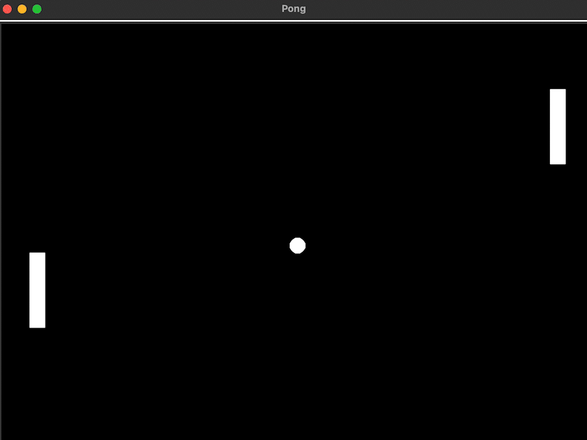

### Set up the Main Screen
```python
from turtle import Screen

# Create a screen using Screen class
screen = Screen()
# Set the background color to black
screen.bgcolor("black")
# Set the screen size
screen.setup(width = 800, height = 600)
# Set the screen title
screen.title("Pong")
# Set the screen to disappear when it is clicked
screen.exitonclick()
```
​
<br>

<div align = "center">
  
</div>

<br>

---

### Create a Paddle that responds to Key Presses

```python
from turtle import Screen, Turtle

# Create a screen using Screen class
screen = Screen()
# Set the background color to black
screen.bgcolor("black")
# Set the screen size
screen.setup(width = 800, height = 600)
# Set the screen title
screen.title("Pong")
# Remove the animation
screen.tracer(0)

# Create a paddle using Turtle class
paddle = Turtle()
# Set the paddle's shape to square
paddle.shape("square")
# Set the paddle color to white so that it is visible
paddle.color("white")
# Do not need to draw the paddle moving to its start position
paddle.penup()
# Make the paddle go to the position (350, 0)
paddle.goto(350, 0)

# Go up function
def go_up():
    # Change the y coordinate
    new_y = paddle.ycor() + 20
    # Move the paddle's position
    paddle.goto(paddle.xcor(), new_y)

# Go down function
def go_down():
    # Change the y coordinate
    new_y = paddle.ycor() - 20
    # Move the paddle's position
    paddle.goto(paddle.xcor(), new_y)

# Make screen to listen for keystrokes
screen.listen()
# Make the paddle move up when the up key is pressed
screen.onkey(go_up, "Up")
# Make the paddle move down when the down key is pressed
screen.onkey(go_down, "Down")
# Stretch the width by 5 (to make 100 * 20 from 20 * 20)
paddle.shapesize(stretch_wid = 5, stretch_len = 1)

# Manually update the screen and refresh it every single time
game_is_on = True
while game_is_on:
    screen.update()

# Set the screen to disappear when it is clicked
screen.exitonclick()
```

<br>

<div align = "center">
  
</div>

<br>

---

### Write the Paddle Class and Create the Second Paddle

```python
# paddle.py
from turtle import Turtle

# Create Paddle class + Inherit Turtle class
class Paddle(Turtle):
    # Initialise new paddle object
    def __init__(self, position):
        super().__init__()
        # Set the paddle's shape to square
        self.shape("square")
        # Set the paddle color to white so that it is visible
        self.color("white")
        # Stretch the width by 5 (to make 100 * 20 from 20 * 20)
        self.shapesize(stretch_wid = 5, stretch_len = 1)
        # Do not need to draw the paddle moving to its start position
        self.penup()
        # Make the paddle go to the position
        self.goto(position)

    # Go up function
    def go_up(self):
        # Change the y coordinate
        new_y = self.ycor() + 20
        # Move the paddle's position
        self.goto(self.xcor(), new_y)

    # Go down function
    def go_down(self):
        # Change the y coordinate
        new_y = self.ycor() - 20
        # Move the paddle's position
        self.goto(self.xcor(), new_y)

```

```python
# main.py
from turtle import Screen, Turtle
from paddle import Paddle

# Create a screen using Screen class
screen = Screen()
# Set the background color to black
screen.bgcolor("black")
# Set the screen size
screen.setup(width = 800, height = 600)
# Set the screen title
screen.title("Pong")
# Remove the animation
screen.tracer(0)

# Create right paddle
r_paddle = Paddle((350,0))
# Create left paddle
l_paddle = Paddle((-350,0))

# Make screen to listen for keystrokes
screen.listen()
# Make the right paddle move up when the up key is pressed
screen.onkey(r_paddle.go_up, "Up")
# Make the right paddle move down when the down key is pressed
screen.onkey(r_paddle.go_down, "Down")
# Make the left paddle move up when the "w" key is pressed
screen.onkey(l_paddle.go_up, "w")
# Make the left paddle move down when the "s" key is pressed
screen.onkey(l_paddle.go_down, "s")

# Manually update the screen and refresh it every single time
game_is_on = True
while game_is_on:
    screen.update()

# Set the screen to disappear when it is clicked
screen.exitonclick()
```

<br>

<div align = "center">
  
</div>

<br>

---

### Write the Ball Class and Make the Ball Move

```python
# paddle.py
from turtle import Turtle

# Create Paddle class + Inherit Turtle class
class Paddle(Turtle):
    # Initialise new paddle object
    def __init__(self, position):
        super().__init__()
        # Set the paddle's shape to square
        self.shape("square")
        # Set the paddle color to white so that it is visible
        self.color("white")
        # Stretch the width by 5 (to make 100 * 20 from 20 * 20)
        self.shapesize(stretch_wid = 5, stretch_len = 1)
        # Do not need to draw the paddle moving to its start position
        self.penup()
        # Make the paddle go to the position
        self.goto(position)

    # Go up function
    def go_up(self):
        # Change the y coordinate
        new_y = self.ycor() + 20
        # Move the paddle's position
        self.goto(self.xcor(), new_y)

    # Go down function
    def go_down(self):
        # Change the y coordinate
        new_y = self.ycor() - 20
        # Move the paddle's position
        self.goto(self.xcor(), new_y)

```

```python
# ball.py
from turtle import Turtle

# Create Ball class + Inherit Turtle class
class Ball(Turtle):
    # Initialise new ball object
    def __init__(self):
        super().__init__()
        # Set the ball color to white so that it is visible
        self.color("white")
        # Set the ball's shape to circle
        self.shape("circle")
        # Do not need to draw the ball moving to its start position
        self.penup()

    def move(self):
        # Change the x coordinate
        new_x = self.xcor() + 10
        # Change the y coordinate
        new_y = self.ycor() + 10
        # Move the ball's position
        self.goto(new_x, new_y)

```

```python
# main.py
from turtle import Screen, Turtle
from paddle import Paddle
from ball import Ball
import time

# Create a screen using Screen class
screen = Screen()
# Set the background color to black
screen.bgcolor("black")
# Set the screen size
screen.setup(width = 800, height = 600)
# Set the screen title
screen.title("Pong")
# Remove the animation
screen.tracer(0)

# Create right paddle
r_paddle = Paddle((350,0))
# Create left paddle
l_paddle = Paddle((-350,0))
# Create ball object from the ball class
ball = Ball()

# Make screen to listen for keystrokes
screen.listen()
# Make the right paddle move up when the up key is pressed
screen.onkey(r_paddle.go_up, "Up")
# Make the right paddle move down when the down key is pressed
screen.onkey(r_paddle.go_down, "Down")
# Make the left paddle move up when the "w" key is pressed
screen.onkey(l_paddle.go_up, "w")
# Make the left paddle move down when the "s" key is pressed
screen.onkey(l_paddle.go_down, "s")

# Manually update the screen and refresh it every single time
game_is_on = True
while game_is_on:
    time.sleep(0.1)
    screen.update()
    ball.move()

# Set the screen to disappear when it is clicked
screen.exitonclick()
```

<br>

<div align = "center">
  
</div>

<br>

---

### Add the Ball Bouncing Logic

```python
# paddle.py
from turtle import Turtle

# Create Paddle class + Inherit Turtle class
class Paddle(Turtle):
    # Initialise new paddle object
    def __init__(self, position):
        super().__init__()
        # Set the paddle's shape to square
        self.shape("square")
        # Set the paddle color to white so that it is visible
        self.color("white")
        # Stretch the width by 5 (to make 100 * 20 from 20 * 20)
        self.shapesize(stretch_wid = 5, stretch_len = 1)
        # Do not need to draw the paddle moving to its start position
        self.penup()
        # Make the paddle go to the position
        self.goto(position)

    # Go up function
    def go_up(self):
        # Change the y coordinate
        new_y = self.ycor() + 20
        # Move the paddle's position
        self.goto(self.xcor(), new_y)

    # Go down function
    def go_down(self):
        # Change the y coordinate
        new_y = self.ycor() - 20
        # Move the paddle's position
        self.goto(self.xcor(), new_y)

```

```python
# ball.py
from turtle import Turtle

# Create Ball class + Inherit Turtle class
class Ball(Turtle):
    # Initialise new ball object
    def __init__(self):
        super().__init__()
        # Set the ball color to white so that it is visible
        self.color("white")
        # Set the ball's shape to circle
        self.shape("circle")
        # Do not need to draw the ball moving to its start position
        self.penup()
        # Create attributes to reverse the ball's direction
        self.x_move = 10
        self.y_move = 10

    def move(self):
        # Change the x coordinate
        new_x = self.xcor() + self.x_move
        # Change the y coordinate
        new_y = self.ycor() + self.y_move
        # Move the ball's position
        self.goto(new_x, new_y)

    def bounce(self):
        # When the ball hits the top or the bottom wall, reverse its y direction
        self.y_move *= -1
```

```python
# main.py
from turtle import Screen, Turtle
from paddle import Paddle
from ball import Ball
import time

# Create a screen using Screen class
screen = Screen()
# Set the background color to black
screen.bgcolor("black")
# Set the screen size
screen.setup(width = 800, height = 600)
# Set the screen title
screen.title("Pong")
# Remove the animation
screen.tracer(0)

# Create right paddle
r_paddle = Paddle((350,0))
# Create left paddle
l_paddle = Paddle((-350,0))
# Create ball object from the ball class
ball = Ball()

# Make screen to listen for keystrokes
screen.listen()
# Make the right paddle move up when the up key is pressed
screen.onkey(r_paddle.go_up, "Up")
# Make the right paddle move down when the down key is pressed
screen.onkey(r_paddle.go_down, "Down")
# Make the left paddle move up when the "w" key is pressed
screen.onkey(l_paddle.go_up, "w")
# Make the left paddle move down when the "s" key is pressed
screen.onkey(l_paddle.go_down, "s")

# Manually update the screen and refresh it every single time
game_is_on = True
while game_is_on:
    time.sleep(0.1)
    screen.update()
    ball.move()

    # Detect collision with wall
    if ball.ycor() > 280 or ball.ycor() < -280:
        # needs to bounce
        ball.bounce()

# Set the screen to disappear when it is clicked
screen.exitonclick()
```

<br>

<div align = "center">
  
</div>

<br>

---

### How to Detect Collisions with the Paddle

```python
# paddle.py
from turtle import Turtle

# Create Paddle class + Inherit Turtle class
class Paddle(Turtle):
    # Initialise new paddle object
    def __init__(self, position):
        super().__init__()
        # Set the paddle's shape to square
        self.shape("square")
        # Set the paddle color to white so that it is visible
        self.color("white")
        # Stretch the width by 5 (to make 100 * 20 from 20 * 20)
        self.shapesize(stretch_wid = 5, stretch_len = 1)
        # Do not need to draw the paddle moving to its start position
        self.penup()
        # Make the paddle go to the position
        self.goto(position)

    # Go up function
    def go_up(self):
        # Change the y coordinate
        new_y = self.ycor() + 20
        # Move the paddle's position
        self.goto(self.xcor(), new_y)

    # Go down function
    def go_down(self):
        # Change the y coordinate
        new_y = self.ycor() - 20
        # Move the paddle's position
        self.goto(self.xcor(), new_y)

```

```python
# ball.py
from turtle import Turtle

# Create Ball class + Inherit Turtle class
class Ball(Turtle):
    # Initialise new ball object
    def __init__(self):
        super().__init__()
        # Set the ball color to white so that it is visible
        self.color("white")
        # Set the ball's shape to circle
        self.shape("circle")
        # Do not need to draw the ball moving to its start position
        self.penup()
        # Create attributes to reverse the ball's direction
        self.x_move = 10
        self.y_move = 10

    def move(self):
        # Change the x coordinate
        new_x = self.xcor() + self.x_move
        # Change the y coordinate
        new_y = self.ycor() + self.y_move
        # Move the ball's position
        self.goto(new_x, new_y)

    def bounce_y(self):
        # When the ball hits the top or the bottom wall, reverse its y direction
        self.y_move *= -1

    def bounce_x(self):
        # When the ball hits the left or the right side of the wall, reverse its x direction
        self.x_move *= -1

```

```python
# main.py
from turtle import Screen, Turtle
from paddle import Paddle
from ball import Ball
import time

# Create a screen using Screen class
screen = Screen()
# Set the background color to black
screen.bgcolor("black")
# Set the screen size
screen.setup(width = 800, height = 600)
# Set the screen title
screen.title("Pong")
# Remove the animation
screen.tracer(0)

# Create right paddle
r_paddle = Paddle((350,0))
# Create left paddle
l_paddle = Paddle((-350,0))
# Create ball object from the ball class
ball = Ball()

# Make screen to listen for keystrokes
screen.listen()
# Make the right paddle move up when the up key is pressed
screen.onkey(r_paddle.go_up, "Up")
# Make the right paddle move down when the down key is pressed
screen.onkey(r_paddle.go_down, "Down")
# Make the left paddle move up when the "w" key is pressed
screen.onkey(l_paddle.go_up, "w")
# Make the left paddle move down when the "s" key is pressed
screen.onkey(l_paddle.go_down, "s")

# Manually update the screen and refresh it every single time
game_is_on = True
while game_is_on:
    time.sleep(0.1)
    screen.update()
    ball.move()

    # Detect collision with wall
    if ball.ycor() > 280 or ball.ycor() < -280:
        # needs to bounce
        ball.bounce_y()

    # Detect collision with paddle
    if ball.distance(r_paddle) < 50 and ball.xcor() > 320 or ball.distance(l_paddle) < 50 and ball.xcor() < -320:
        ball.bounce_x()

# Set the screen to disappear when it is clicked
screen.exitonclick()
```

<br>

<div align = "center">
  
</div>

<br>

---

### How to Detect when the Ball goes Out of Bounds

```python
# paddle.py
from turtle import Turtle

# Create Paddle class + Inherit Turtle class
class Paddle(Turtle):
    # Initialise new paddle object
    def __init__(self, position):
        super().__init__()
        # Set the paddle's shape to square
        self.shape("square")
        # Set the paddle color to white so that it is visible
        self.color("white")
        # Stretch the width by 5 (to make 100 * 20 from 20 * 20)
        self.shapesize(stretch_wid = 5, stretch_len = 1)
        # Do not need to draw the paddle moving to its start position
        self.penup()
        # Make the paddle go to the position
        self.goto(position)

    # Go up function
    def go_up(self):
        # Change the y coordinate
        new_y = self.ycor() + 20
        # Move the paddle's position
        self.goto(self.xcor(), new_y)

    # Go down function
    def go_down(self):
        # Change the y coordinate
        new_y = self.ycor() - 20
        # Move the paddle's position
        self.goto(self.xcor(), new_y)

```

```python
# ball.py
from turtle import Turtle

# Create Ball class + Inherit Turtle class
class Ball(Turtle):
    # Initialise new ball object
    def __init__(self):
        super().__init__()
        # Set the ball color to white so that it is visible
        self.color("white")
        # Set the ball's shape to circle
        self.shape("circle")
        # Do not need to draw the ball moving to its start position
        self.penup()
        # Create attributes to reverse the ball's direction
        self.x_move = 10
        self.y_move = 10

    def move(self):
        # Change the x coordinate
        new_x = self.xcor() + self.x_move
        # Change the y coordinate
        new_y = self.ycor() + self.y_move
        # Move the ball's position
        self.goto(new_x, new_y)

    def bounce_y(self):
        # When the ball hits the top or the bottom wall, reverse its y direction
        self.y_move *= -1

    def bounce_x(self):
       # When the ball hits the left or the right side of the wall, reverse its x direction# When the ball hits the left or the right side of the wall, reverse its x direction
        self.x_move *= -1

    def reset_position(self):
        self.goto(0, 0)
        self.bounce_x()
```

```python
# main.py
from turtle import Screen, Turtle
from paddle import Paddle
from ball import Ball
import time

# Create a screen using Screen class
screen = Screen()
# Set the background color to black
screen.bgcolor("black")
# Set the screen size
screen.setup(width = 800, height = 600)
# Set the screen title
screen.title("Pong")
# Remove the animation
screen.tracer(0)

# Create right paddle
r_paddle = Paddle((350,0))
# Create left paddle
l_paddle = Paddle((-350,0))
# Create ball object from the ball class
ball = Ball()

# Make screen to listen for keystrokes
screen.listen()
# Make the right paddle move up when the up key is pressed
screen.onkey(r_paddle.go_up, "Up")
# Make the right paddle move down when the down key is pressed
screen.onkey(r_paddle.go_down, "Down")
# Make the left paddle move up when the "w" key is pressed
screen.onkey(l_paddle.go_up, "w")
# Make the left paddle move down when the "s" key is pressed
screen.onkey(l_paddle.go_down, "s")

# Manually update the screen and refresh it every single time
game_is_on = True
while game_is_on:
    time.sleep(0.1)
    screen.update()
    ball.move()

    # Detect collision with wall
    if ball.ycor() > 280 or ball.ycor() < -280:
        # needs to bounce
        ball.bounce_y()

    # Detect collision with paddle
    if ball.distance(r_paddle) < 50 and ball.xcor() > 320 or ball.distance(l_paddle) < 50 and ball.xcor() < -320:
        ball.bounce_x()

    # Detect R paddle misses
    if ball.xcor() > 380:
        ball.reset_position()

    # Detect L paddle misses
    if ball.xcor() < -380:
        ball.reset_position()

# Set the screen to disappear when it is clicked
screen.exitonclick()
```

<br>

<div align = "center">
  
</div>

<br>

---

### Score Keeping and Changing the Ball Speed

```python
# paddle.py
from turtle import Turtle

# Create Paddle class + Inherit Turtle class
class Paddle(Turtle):
    # Initialise new paddle object
    def __init__(self, position):
        super().__init__()
        # Set the paddle's shape to square
        self.shape("square")
        # Set the paddle color to white so that it is visible
        self.color("white")
        # Stretch the width by 5 (to make 100 * 20 from 20 * 20)
        self.shapesize(stretch_wid = 5, stretch_len = 1)
        # Do not need to draw the paddle moving to its start position
        self.penup()
        # Make the paddle go to the position
        self.goto(position)

    # Go up function
    def go_up(self):
        # Change the y coordinate
        new_y = self.ycor() + 20
        # Move the paddle's position
        self.goto(self.xcor(), new_y)

    # Go down function
    def go_down(self):
        # Change the y coordinate
        new_y = self.ycor() - 20
        # Move the paddle's position
        self.goto(self.xcor(), new_y)

```

```python
# ball.py
from turtle import Turtle

# Create Ball class + Inherit Turtle class
class Ball(Turtle):
    # Initialise new ball object
    def __init__(self):
        super().__init__()
        # Set the ball color to white so that it is visible
        self.color("white")
        # Set the ball's shape to circle
        self.shape("circle")
        # Do not need to draw the ball moving to its start position
        self.penup()
        # Create attributes to reverse the ball's direction
        self.x_move = 10
        self.y_move = 10
        # Create attribute for a ball's speed
        self.move_speed = 0.1

    def move(self):
        # Change the x coordinate
        new_x = self.xcor() + self.x_move
        # Change the y coordinate
        new_y = self.ycor() + self.y_move
        # Move the ball's position
        self.goto(new_x, new_y)

    def bounce_y(self):
        # When the ball hits the top or the bottom wall, reverse its y direction
        self.y_move *= -1

    def bounce_x(self):
        # When the ball hits the left or the right side of the wall, reverse its x direction
        self.x_move *= -1
        # Adjust the ball speed
        self.move_speed *= 0.9

    def reset_position(self):
        self.goto(0, 0)
        self.bounce_x()
        # Reset the ball speed
        self.move_speed = 0.1
```

```python
# scoreboard.py
from turtle import Turtle

# Create Scoreboard class + Inherit Turtle class
class Scoreboard(Turtle):
    # Initialise new Scoreboard object
    def __init__(self):
        super().__init__()
        # Set the scoreboard color to white so that it is visible
        self.color("white")
        # Do not need to draw the scoreboard
        self.penup()
        # Do not need turtle to be able to write something
        self.hideturtle()
        # Create attributes for the scoreboard class
        self.l_score = 0
        self.r_score = 0
        # Call update_scoreboard when the scoreboard is initialised firstly and when a player score a point
        self.update_scoreboard()

    def update_scoreboard(self):
        # Erase the score for the update
        self.clear()
        # Write left-sided player's score on the screen
        self.goto(-100, 200)
        self.write(self.l_score, align="center", font=("Courier", 80, "normal"))
        # Write right-sided player's score on the screen
        self.goto(100, 200)
        self.write(self.r_score, align="center", font=("Courier", 80, "normal"))

    def l_point(self):
        self.l_score += 1
        self.update_scoreboard()

    def r_point(self):
        self.r_score += 1
        self.update_scoreboard()

```

```python
# main.py
from turtle import Screen, Turtle
from paddle import Paddle
from ball import Ball
from scoreboard import Scoreboard
import time

# Create a screen using Screen class
screen = Screen()
# Set the background color to black
screen.bgcolor("black")
# Set the screen size
screen.setup(width = 800, height = 600)
# Set the screen title
screen.title("Pong")
# Remove the animation
screen.tracer(0)

# Create right paddle
r_paddle = Paddle((350,0))
# Create left paddle
l_paddle = Paddle((-350,0))
# Create ball object from the ball class
ball = Ball()
# Create scoreboard object
scoreboard = Scoreboard()

# Make screen to listen for keystrokes
screen.listen()
# Make the right paddle move up when the up key is pressed
screen.onkey(r_paddle.go_up, "Up")
# Make the right paddle move down when the down key is pressed
screen.onkey(r_paddle.go_down, "Down")
# Make the left paddle move up when the "w" key is pressed
screen.onkey(l_paddle.go_up, "w")
# Make the left paddle move down when the "s" key is pressed
screen.onkey(l_paddle.go_down, "s")

# Manually update the screen and refresh it every single time
game_is_on = True
while game_is_on:
    time.sleep(ball.move_speed)
    screen.update()
    ball.move()

    # Detect collision with wall
    if ball.ycor() > 280 or ball.ycor() < -280:
        # needs to bounce
        ball.bounce_y()

    # Detect collision with paddle
    if ball.distance(r_paddle) < 50 and ball.xcor() > 320 or ball.distance(l_paddle) < 50 and ball.xcor() < -320:
        ball.bounce_x()

    # Detect R paddle misses
    if ball.xcor() > 380:
        ball.reset_position()
        scoreboard.l_point()

    # Detect L paddle misses
    if ball.xcor() < -380:
        ball.reset_position()
        scoreboard.r_point()

# Set the screen to disappear when it is clicked
screen.exitonclick()
```

<br>

<div align = "center">
  
</div>

<br>

