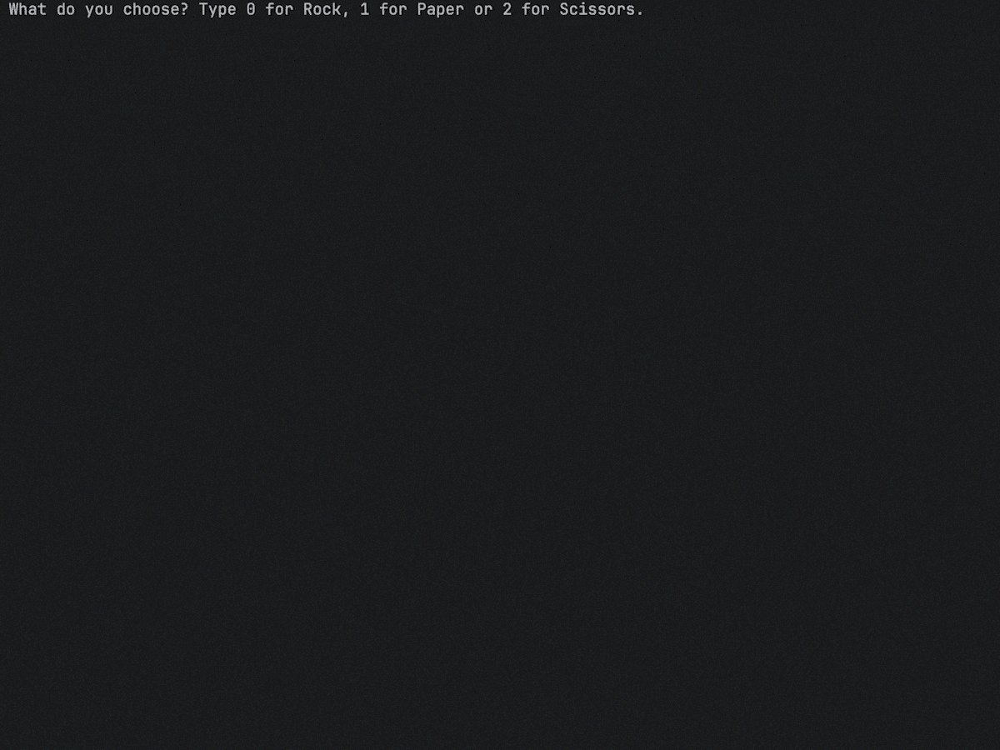

### Day 4 Project: Rock Paper Scissors

 

  

 

1. Ask users to type zero for rock, one for paper or two for scissors
2. Show users a graphic of their choice and the computer’s choice
3. Compare the user’s choice against randomly generated computer choice
4. Based on the rules of rock, paper, scissors, determine whether if user won or lost or drew

 
